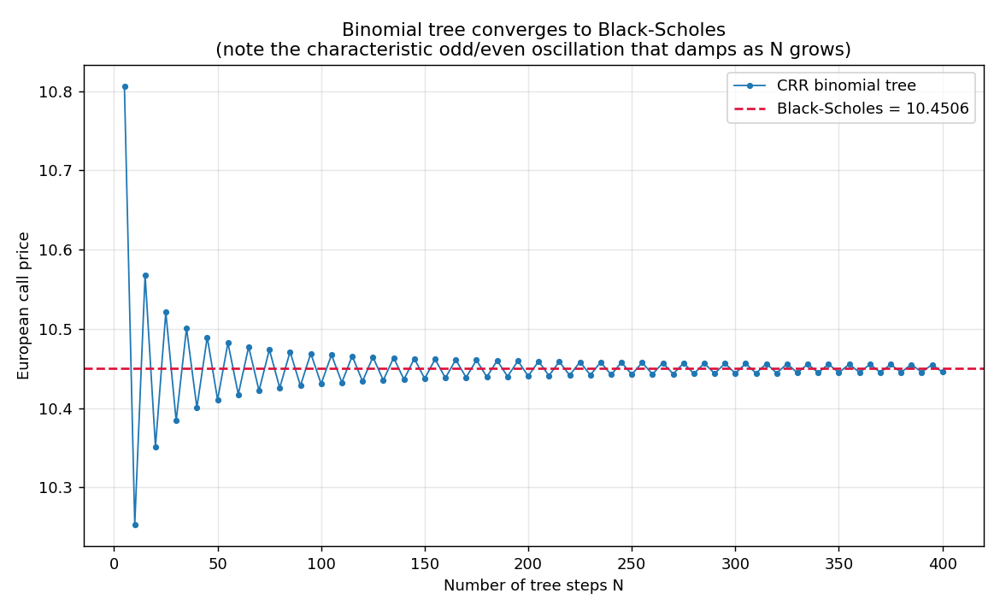
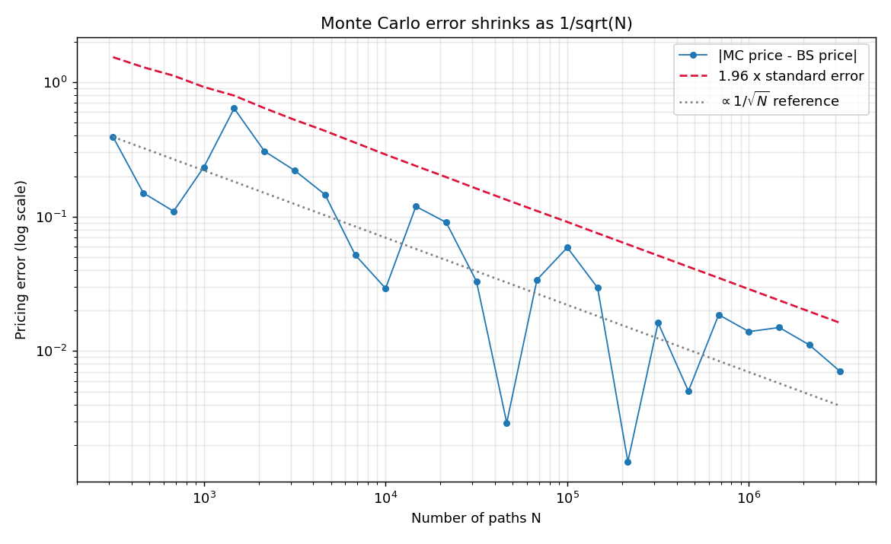
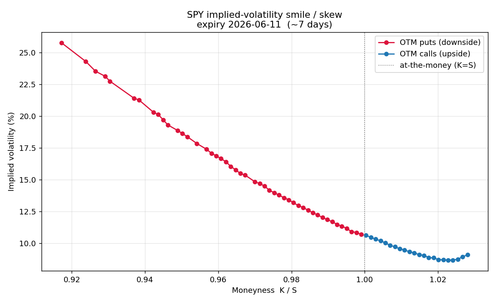
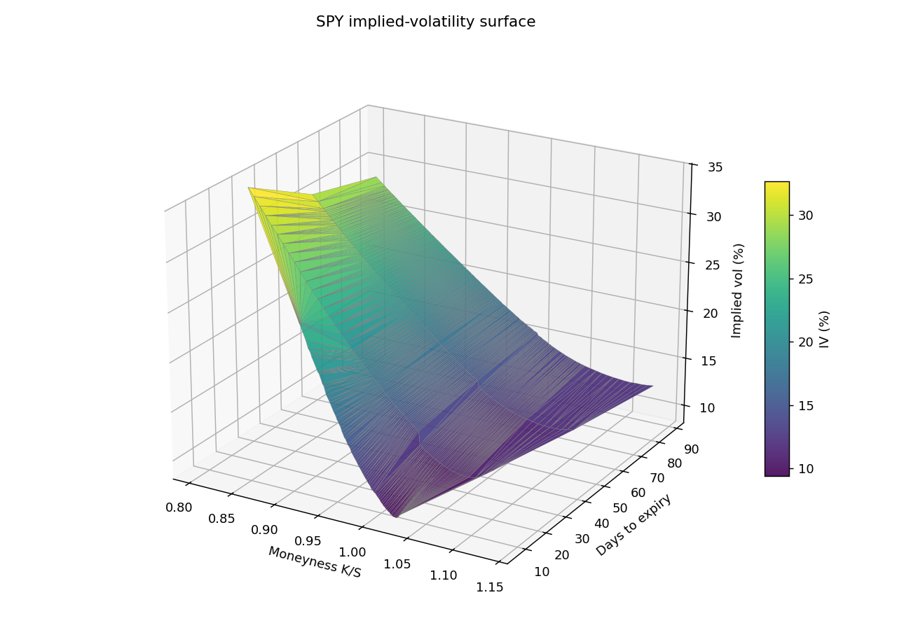
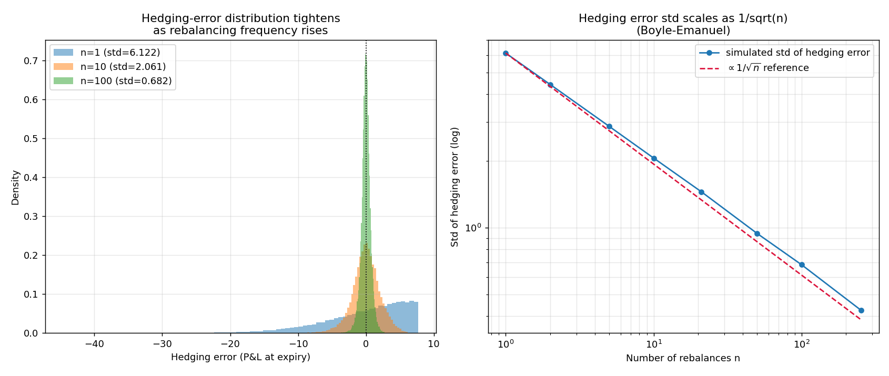

# Options Pricing & the Implied Volatility Surface

A from-scratch options-pricing library (Black-Scholes, binomial tree, Monte Carlo) with full
Greeks, plus an empirical study that backs implied volatilities out of a **real SPY option chain**
and analyses the volatility smile/skew, capped with a **delta-hedging simulation** that quantifies
hedging error.

## Summary

Implemented three independent pricing methods that **agree to within Monte-Carlo error** (this
three-way agreement is the correctness proof — closed-form, lattice, and random-sampling errors
are unrelated, so agreement is strong evidence). Backed implied vols out of a real SPY chain with a
Brent root-finder and documented the characteristic **downward equity skew** (OTM puts richer than
OTM calls — the market pricing crash risk). Simulated delta hedging and showed the hedging-error
standard deviation shrinks as **1/√n** with rebalancing frequency, demonstrating that the BS price
is the **cost of replication**, not a forecast.

## Key results

**Three-way pricing agreement** (S=100, K=100, T=1y, r=5%, σ=20%, q=0) — the correctness proof:

| Option | Black-Scholes | CRR tree (N=2000) | Monte Carlo (1M paths, antithetic) |
|--------|--------------:|------------------:|-----------------------------------:|
| Call   | 10.4506       | 10.4496           | 10.4365 (BS inside 95% CI)         |
| Put    | 5.5735        | 5.5725            | 5.5645 (BS inside 95% CI)          |

Supporting checks: put-call parity abs error `0.00e+00`; analytic vs finite-difference Greeks match
to 6 dp; tree→BS error `1e-3` at N=2000; American-put early-exercise premium `+0.518`; American
call = European call at q=0; round-trip implied-vol recovery to `5e-10`; antithetic variates cut MC
std by ~30%.

**Empirical skew** (real SPY chain, spot ≈ 757.7, snapshot 2026-06-04; r=4.3%, q=1.2%):

| Expiry (~days) | ATM IV | OTM-put IV (~0.95) | OTM-call IV (~1.05) | Put−call skew |
|---------------:|-------:|-------------------:|--------------------:|--------------:|
| 7              | 10.6%  | 18.6%              | 9.1%                | **+9.56%**    |
| 28             | 12.3%  | 17.8%              | 10.2%               | **+7.60%**    |
| 57             | 14.0%  | 18.0%              | 11.9%               | **+6.11%**    |
| 88             | 15.2%  | 18.2%              | 13.1%               | **+5.11%**    |

Downward skew at every expiry (OTM puts richer — crash-risk pricing), steepening at the short end;
upward-sloping ATM term structure (calm-market contango).

**Delta-hedging error** (short ATM call, path drift μ=0.10 ≠ r=0.05, 40k paths, frictionless):

| Rebalances n | 1 | 2 | 5 | 10 | 21 | 50 | 100 | 252 |
|--------------|--:|--:|--:|---:|---:|---:|----:|----:|
| Mean error   | −0.19 | −0.11 | −0.04 | 0.00 | −0.02 | 0.00 | −0.01 | 0.00 |
| Std error    | 6.12 | 4.42 | 2.87 | 2.06 | 1.45 | 0.94 | 0.68 | 0.43 |

Mean ≈ 0 confirms drift-independent replication; `std·√n` stays ≈ 6.1–6.8 (the 1/√n law,
Boyle-Emanuel). With 5 bps costs, mean P&L turns negative and worsens with frequency (−0.14 at n=5
→ −0.31 at n=252) — the discretization-vs-cost tradeoff.

> Empirical numbers are tied to the saved SPY snapshot (2026-06-04). Re-running `src/fetch_data.py`
> refreshes the chain and will shift them to the new market date.

## Pricing engine

- **Black-Scholes + full Greeks** (`src/black_scholes.py`) — delta, gamma, vega, theta, rho, all
  derived in the docstrings. Validated by put-call parity (exact) and finite-difference checks.
- **Binomial tree** (`src/binomial_tree.py`) — Cox-Ross-Rubinstein, European *and* American.
  Converges to Black-Scholes as steps grow (with the classic odd/even oscillation); American put
  shows a positive early-exercise premium; American call = European call when q=0 (as it must).
- **Monte Carlo** (`src/monte_carlo.py`) — GBM terminal-price simulation with reported standard
  error (shrinks as 1/√N) and **antithetic-variates** variance reduction (~30% lower std at equal
  cost).
- **Three-way agreement table** — the unit test. BS / tree / MC land on the same call and put
  prices, with BS inside the MC 95% confidence interval.

| Tree → Black-Scholes | Monte Carlo error ~ 1/√N |
|:--:|:--:|
|  |  |

## Empirical volatility study

- **Data source:** real **SPY** (S&P 500 ETF) option chain via `yfinance`, snapshotted to
  `data/option_chain.csv`. SPY is chosen because NSE blocks programmatic scraping and SPY's deep
  liquidity gives a clean, well-defined skew (the spec's recommended fallback). The loader reads a
  plain CSV, so an NSE export can be swapped in without code changes.
- **Stated assumptions:** spot from the snapshot; risk-free rate `r = 4.3%` (US 3-month T-bill,
  continuously compounded); dividend yield `q = 1.2%` (SPY). Time to expiry in years, ACT/365.
- **Method:** mid (bid-ask average) prices; clean filters drop options without two-sided quotes,
  below a minimum price, outside a 0.80–1.20 moneyness band, or with no open interest. The OTM wing
  (puts below spot, calls above spot) is used because those quotes are the most liquid and least
  contaminated by early exercise. Implied vol via `scipy.optimize.brentq`.
- **American-vs-European caveat:** SPY options are American. We use short-dated OTM contracts where
  the early-exercise premium is negligible and treat them as European for the BS inversion.
- **Findings:** downward skew at every expiry (OTM-put minus OTM-call IV is positive and steepens
  at the short end), and an upward-sloping vol term structure (calm-market contango). See
  `results/vol_smile.png` and `results/vol_surface_3d.png`.
- **Framing:** the smile *is the evidence Black-Scholes is wrong* — the market corrects BS's flat-
  vol / normal-returns assumption. We do not claim BS "predicts" the prices.

| Volatility smile / skew | 3D implied-vol surface |
|:--:|:--:|
|  |  |

## Delta-hedging experiment

- Sell one ATM call at its BS price, then delta-hedge to expiry along simulated GBM paths,
  rebalancing at a chosen frequency with an interest-bearing cash account.
- **Hedging error** = final P&L of (short option + dynamic stock hedge + cash). Frictionless mean
  ≈ 0 even when the path drift `mu ≠ r` (replication is drift-independent), and the error standard
  deviation scales as **1/√n** (Boyle-Emanuel). See `results/hedging_error.png`.
- **Transaction costs** (5 bps per trade) push mean P&L negative and grow with rebalancing — the
  real-world tension between discretization error and trading cost.
- **Interpretation:** the BS price is the cost of the replicating portfolio, not a market forecast.



## Repo structure

```
├── README.md
├── requirements.txt
├── data/
│   ├── option_chain.csv      # SPY snapshot (source-agnostic schema)
│   └── implied_vols.csv      # computed IV table
├── src/
│   ├── black_scholes.py      # Module A
│   ├── binomial_tree.py      # Module B
│   ├── monte_carlo.py        # Module C
│   ├── implied_vol.py        # Module D
│   ├── vol_surface.py        # Module E
│   ├── delta_hedging.py      # Module F
│   └── fetch_data.py         # SPY chain downloader
├── notebooks/
│   └── analysis.ipynb        # narrative: pricing agreement -> smile -> hedging (executed)
└── results/
    ├── method_convergence.png   # tree -> BS
    ├── mc_convergence.png       # MC error ~ 1/sqrt(N)
    ├── vol_smile.png            # the skew
    ├── vol_surface_3d.png       # IV surface
    └── hedging_error.png        # hedging error ~ 1/sqrt(n)
```

## Limitations

- Black-Scholes assumes constant volatility — the observed smile is exactly the failure of that
  assumption. No stochastic-vol (Heston) or local-vol model is calibrated here (a stretch goal).
- SPY options are American; we approximate with European BS on short-dated OTM contracts.
- The hedging simulation assumes the true vol is known and constant, and (in the headline run)
  ignores transaction costs; the cost-aware run is reported separately.
- A single chain snapshot is used; no time-series of the surface (variance risk premium) is studied.

## How to run

```bash
pip install -r requirements.txt

# Each module self-tests and writes its plot(s) to results/ when run directly:
python src/black_scholes.py     # prices, Greeks, put-call parity, FD checks
python src/binomial_tree.py     # tree -> BS convergence plot
python src/monte_carlo.py       # stderr scaling, antithetic, 3-way agreement
python src/implied_vol.py       # round-trip IV recovery + edge cases

# Empirical half (needs internet for the SPY download):
python src/fetch_data.py        # download SPY chain -> data/option_chain.csv
python src/vol_surface.py       # smile, 3D surface, skew report

# Capstone:
python src/delta_hedging.py     # hedging error vs rebalance frequency

# Full narrative (reads the saved snapshot; no network needed):
jupyter notebook notebooks/analysis.ipynb
```

The notebook `notebooks/analysis.ipynb` is committed **already executed** (outputs embedded), so it
renders the full story — pricing agreement → real chain → smile → hedging — directly on GitHub.
